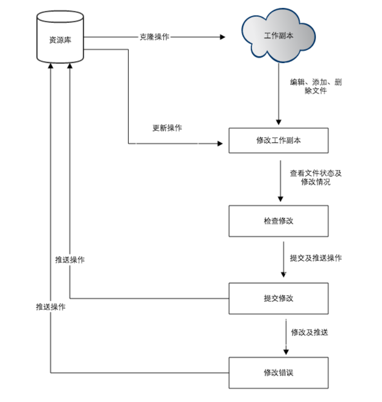
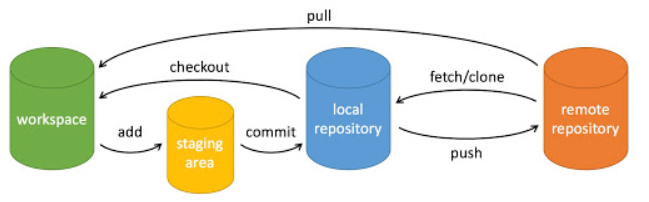
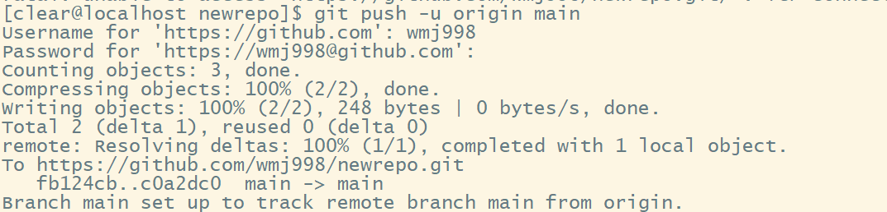
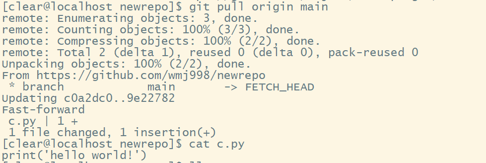

# Git

### Git 概念

+ Git 是一个免费的开源分布式版本控制系统，旨在快速高效地处理从小型到大型项目的所有内容
+ Git 易于学习，占地面积小，具有闪电般的快速性能。它具有诸如Subversion，CVS，Perforce和ClearCase之类的SCM工具，具有廉价的本地分支，便捷的暂存区域和多个工作流等功能

### Git 工作流程

+ 克隆 Git 资源作为工作目录
+ 在克隆的资源上添加或修改文件
+ 如果其他人修改了，你可以更新资源
+ 在提交前查看修改
+ 提交修改
+ 在修改完成后，如果发现错误，可以撤回提交并再次修改并提交

### Linux下的安装

+ sudo yum -y install git

+ git --version

  配置个人信息

  > git config --global user.name "wmj998"
  >
  > git config --global user.email wmj998@foxmail.com
  
  查看个人信息
  
  > git config --list

### 命令行的使用

| 命令             | 说明                                   |
| :--------------- | :------------------------------------- |
| git init         | 初始化仓库                             |
| ***git clone***  | 拷贝一份远程仓库，也就是下载一个项目   |
| ***git add***    | 添加文件到仓库                         |
| git status       | 查看仓库当前的状态，显示有变更的文件   |
| git diff         | 比较文件的不同，即暂存区和工作区的差异 |
| ***git commit*** | 提交暂存区到本地仓库                   |
| git reset        | 回退版本                               |
| git rm           | 删除工作区文件                         |
| git mv           | 移动或重命名工作区文件                 |
| git log          | 查看历史提交记录                       |
| git blame        | 以列表形式查看指定文件的历史修改记录   |
| git remote       | 远程仓库操作                           |
| git fetch        | 从远程获取代码库                       |
| ***git pull***   | 下载远程代码并合并                     |
| ***git push***   | 上传远程代码并合并                     |

> git clone https://github.com/wmj998/newrepo.git
>
> cd newrepo/
>
> git branch test
>
> git checkout test
>
> touch a.py
>
> git add a.py
>
> git commit -m 'Create a.py'
>
> git checkout main
>
> git merge test
>
> git branch -d test
>
> git push -u origin main
>
> 
>
> git pull origin main
>
> 

### Git 分支

| 命令          | 说明     |
| ------------- | -------- |
| git branch    | 创建分支 |
| git checkout  | 切换分支 |
| git merge     | 合并分支 |
| git branch -d | 删除分支 |

Git Flow 的常用分支

+ Production 分支

  也就是我们经常使用的Master分支，这个分支最近发布到生产环境的代码，最近发布的Release， 这个分支只能从其他分支合并，不能在这个分支直接修改

+ Develop 分支

  这个分支是我们是我们的主开发分支，包含所有要发布到下一个Release的代码，这个主要合并与其他分支，比如Feature分支

+ Feature 分支

  这个分支主要是用来开发一个新的功能，一旦开发完成，我们合并回Develop分支进入下一个Release

+ Release分支

  当你需要一个发布一个新Release的时候，我们基于Develop分支创建一个Release分支，完成Release后，我们合并到Master和Develop分支

+ Hotfix分支

  当我们在Production发现新的Bug时候，我们需要创建一个Hotfix, 完成Hotfix后，我们合并回Master和Develop分支，所以Hotfix的改动会进入下一个Release

Git 是一个开源的分布式版本控制系统，用于敏捷高效地处理任何或小或大的项目。采用了分布式版本库的方式，不必服务器端软件支持

