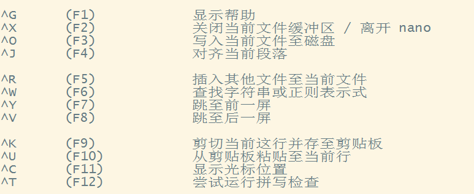
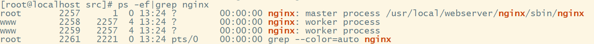
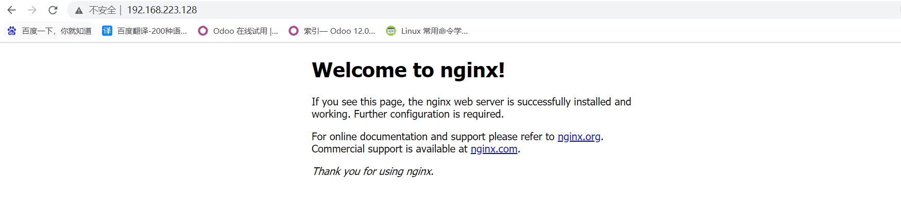

# Linux


##  vi / nano 命令使用

vi 命令

nano 命令




## 目录权限设置，角色设置(chmod, chown)

chmod 命令，修改文件的权限和文件的属性

| who  | 用户类型 | 说明             |
| ---- | -------- | ---------------- |
| u    | user     | 文件所有者       |
| g    | group    | 文件所有者所在组 |
| o    | others   | 所有其他用户     |
| a    | all      | 所有用户         |

| 权限类型 |  权限  | 数字表示 |
| :------: | :----: | :------: |
|    r     |  只读  |    4     |
|    w     |   写   |    2     |
|    x     | 可执行 |    1     |
|    -     |  删除  |    0     |

```shell
chmod a=rwx a.py
```

```shell
chmod 777 b.py
```

chown 命令，将指定文件的拥有者改为指定的用户或组

chown 命令需要root权限

```shell
sudo chown root a.py
```


## ps/aux, grep, find等常用指令

ps 命令，显示当前进程的状态，类似于 windows 的任务管理器

> ps -aux 显示所有包含其他使用者的行程
>
> ps -u 用户   显示指定用户信息
>
> ps -ef | grep 进程关键字   查找指定进程格式

top 命令，显示当前系统正在执行的进程的相关信息

grep 命令，实现在指定文件中特定字符串的查找

> grep [选项] 关键字 文件
>
> -c 计数
>
> -i 不区分大小写
>
> -n 显示行数
>
> -v 显示不包含匹配文本的所有行
>
> -r 对文件无要求

find 命令，查找文件或目录

> find path [选项] 文件


## nginx 安装及配置

###  安装编译工具及库文件

> ```shell
> yum -y install make zlib zlib-devel gcc-c++ libtool  openssl openssl-devel
> ```

### 安装  PCRE

PCRE 作用是让 Nginx 支持重写功能

> 1. 下载 PCRE 安装包
>
>    ```shell
>    cd /usr/local/src/
>    ```
>
>    ```shell
>    wget http://downloads.sourceforge.net/project/pcre/pcre/8.35/pcre-8.35.tar.gz
>    ```
>
> 2. 解压安装包
>
>    ```shell
>    tar zxvf pcre-8.35.tar.gz
>    ```
>
> 3. 编译安装
>
>    ```shell
>    cd pcre-8.35
>    ```
>
>    ```shell
>    ./configure
>    ```
>
>    ```shell
>    make && make install
>    ```
>
> 4. 查看 PCRE 版本
>
>    ```shell
>    pcre-config --version
>    ```

### 安装 Nginx

> 1. 下载 Nginx
>
>    ```shell
>    cd /usr/local/src/
>    ```
>
>    ```shell
>    wget http://nginx.org/download/nginx-1.6.2.tar.gz
>    ```
>
> 2. 解压安装包
>
>    ```shell
>    tar zxvf nginx-1.6.2.tar.gz
>    ```
>
> 3. 编译安装
>
>    ```shell
>    cd nginx-1.6.2
>    ```
>
>    ```shell
>    ./configure --prefix=/usr/local/webserver/nginx --with-http_stub_status_module --with-http_ssl_module --with-pcre=/usr/local/src/pcre-8.35
>    ```
>
>    ```shell
>    make && make install
>    ```
>
> 4. 查看nginx版本
>
>    ```shell
>    /usr/local/webserver/nginx/sbin/nginx -v
>    ```

### 配置 Nginx

> 创建 Nginx 运行使用的用户 www
>
> ```shell
> /usr/sbin/groupadd www 
> ```
>
> ```shell
> /usr/sbin/useradd -g www www
> ```
>
> 配置 nginx.conf 文件
>
> ```shell
> /usr/local/webserver/nginx/conf/nginx.conf
> ```
>
> 检查配置文件 nginx.conf 的正确性
>
> ```shell
> /usr/local/webserver/nginx/sbin/nginx -t
> ```

### 启动 Nginx

> ```shell
> /usr/local/webserver/nginx/sbin/nginx
> ```
>
> 查看进程
>
> ```shell
> ps -ef|grep nginx
> ```
>
> 

### 访问站点



### 停止 Nginx

```shell
/usr/local/webserver/nginx/sbin/nginx -s stop 
```


## 绝对路径、相对路径、各个系统目录的基本作用、系统重要配置文件的说明

绝对路径：从根目录开始

相对路径：当前目录开始

### 系统目录

> /
>
> 根目录
>
> 有且只有一个根目录，所有的东西，都是从这里开始

> /root
>
> 系统管理员(root user)的目录
>
> 它能对系统做任何事情，甚至包括删除文件

> /bin
>
> 存放了标准的(或者说是缺省的)linux的工具，比如像“ls”、“vi”还有“more”等等

> /etc
>
> 主要存放了系统配置方面的文件

> /dev
>
> 主要存放与设备(包括外设)有关的文件(unix和linux系统均把设备当成文件)

> /home
>
> 主要存放用户的个人数据，每个用户的设置文件，除root用户外，每个用户都有自己的用户目录，位置为：/home/用户名

> /tmp
>
> 临时目录

> /usr
>
> 系统存放程序的目录，比如命令、帮助文件等
>
> /usr/bin目录用于存放程序，/usr/share用于存放一些共享的数据，/usr/lib目录用于存放那些不能直接运行的，但却是许多程序运行所必需的一些函数库文件，/usr/loc主要存放那些手动安装的软件

> /opt
>
> 主要存放那些可选的程序（例如测试版）

> /media
>
> 有些linux的发行版使用这个目录来挂载那些usb接口的移动硬盘(包括U盘)、CD/DVD驱动器等等

> /mnt
>
> 一般是用于存放挂载储存设备的挂载目录的

> /proc
>
> 操作系统运行时，进程信息及内核信息（比如cpu、硬盘分区、内存信息等）存放在这里，/proc目录伪装的文件系统proc的挂载目录，proc并不是真正的文件系统

> /sbin
>
> 大多是涉及系统管理的命令的存放，是超级权限用户root的可执行命令存放地，普通用户无权限执行这个目录下的命令

> /var
>
> 这个目录的内容是经常变动的，/var/log 这是用来存放系统日志的目录，/var/lib 用来存放一些库文件

### 系统重要配置文件

> /etc/profile   环境变量文件
>
> /etc/passwd   用户数据库文件
>
> /etc/sysconfig/network-scripts/ifcfg-ens33   网卡配置文件
>
> /etc/resolv.conf   DNS服务配置文件
>
> /etc/hosts   配置host解析
>
> /etc/ssh/sshd_config   ssh服务相关配置文件

